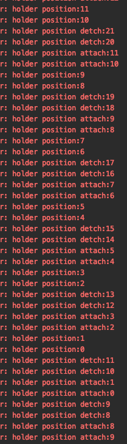

这是我在拖动 RecyclerView 从顶部到底部，又从底部到顶部的 logcat

>  holder position 是 onBindViewHolder 中触发
>
>  holder position attach 是 onViewAttachedToWindow 中触发
>
> holder position detch 是 onViewDetachedFromWindow 中触发
>
> 具体位置可以见代码

可以看到 position 为 8 和 9 时（截图中第 7 行 logcat），这个时候代码触发了 onBindViewHolder 中的

```java
holder.svgaImageView.setVideoItem(entity);
holder.svgaImageView.startAnimation();
```

这个时候其实还是在手势下拉的过程，也就是还在拖拽且未到顶部，继续往下

当我们拖到顶部时，8 和 9 的位置触发 detached，此时 SVGAImageView 内部也会把动画停止清空，所以此时，当重新拖动 RecyclerView 从顶部到底部时，问题就出现了，他仅仅触发了 attach，即 onViewAttachedToWindow，并没有触发 onBindViewHolder，也就是

```java
// onBindViewHolder
holder.svgaImageView.setVideoItem(entity);
holder.svgaImageView.startAnimation();
```

并没有触发，所以导致那两行代码没有使 SVGAImageView 作播放操作。

代码我修改了下，这样子就没什么问题了，其实播放的相关操作最好是放在 attach 和 detach 中进行会比较好一些